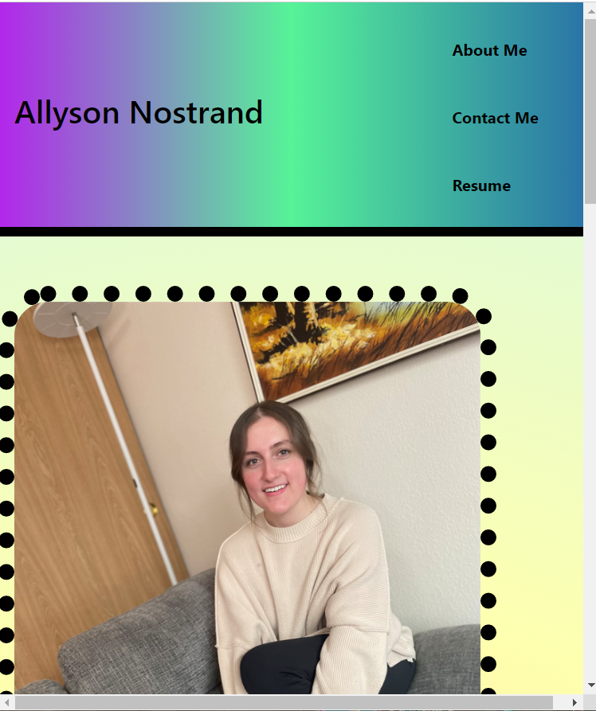
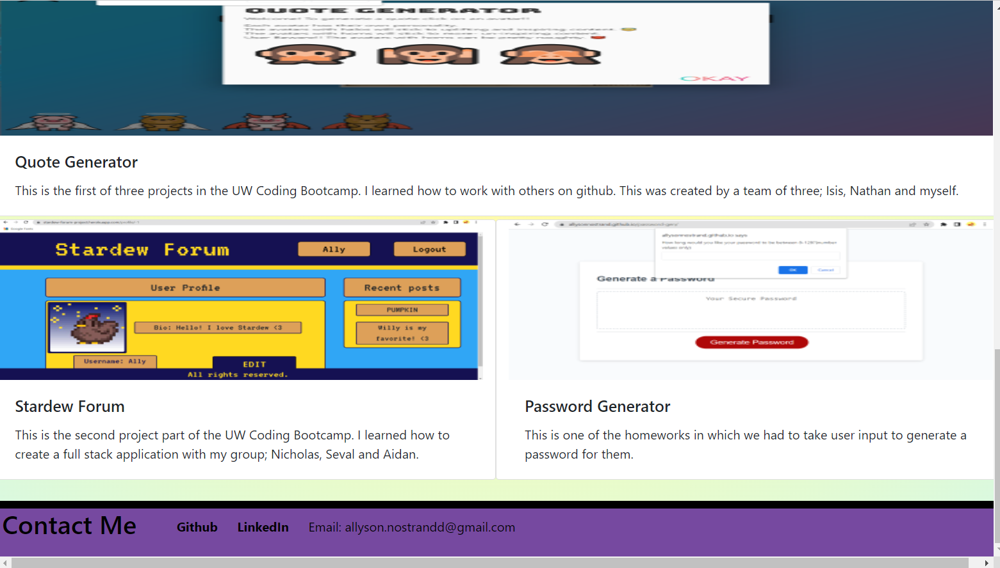

# my-portfolio

## Link
My Portfolio https://allysonnostrand.github.io/my-portfolio/

## Description 

The goal for this assignment was to create a portfolio page to display work samples. This portfolio page will be updated a few times during the course to show off my work once I have completed some projects and to improve the site itself. 

Since I don't have any works to display, I used a variety of fun placeholder images that when clicked- link to my github page. These placeholder images also have titles for when your mouse hovers over them and a "glow" feature. The textboxes over my placeholders have "N/A" displayed to also show that they are not projects. 

The links at the upper right of the page when clicked will snap down to the section it corresponds to. The only exception here is the "Resume" link which does not yet function as I don't have a resume I would like to incorporate at the moment. This will be updated in the near future. 

My "about me" section is currently a little empty, as I don't yet have much experience to share. 

Finally, I have my "contact me" section located in the footer. The github link is the only one currently functional. I have my linkedin address however when clicking the link it brings the viewer to a website with an error code. This will also be updated in the future. I did not include a link for my email as I'm not completely sure if thats something I want to incorporate into my site. 

# Screenshots

Here is a screenshot of my portfolio!

